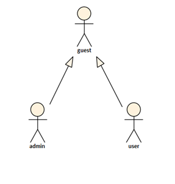
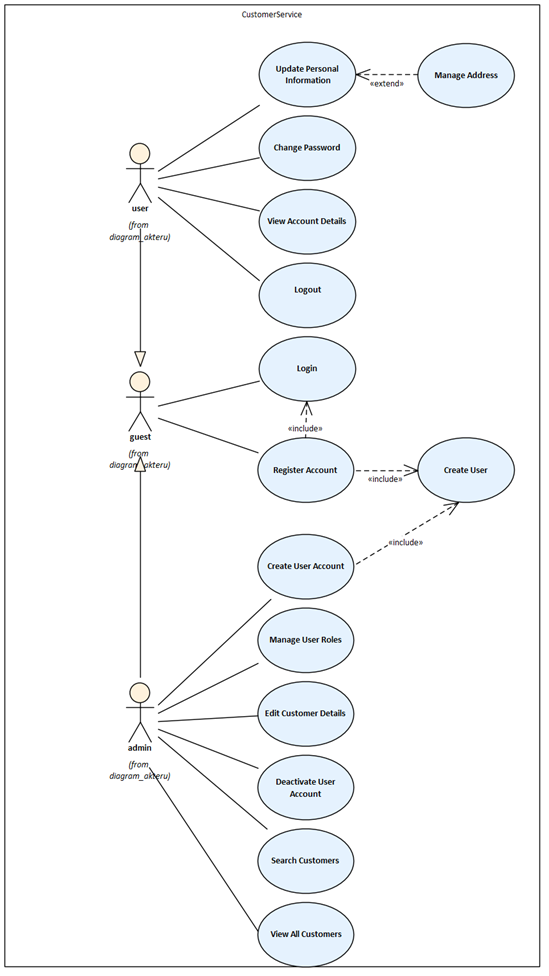
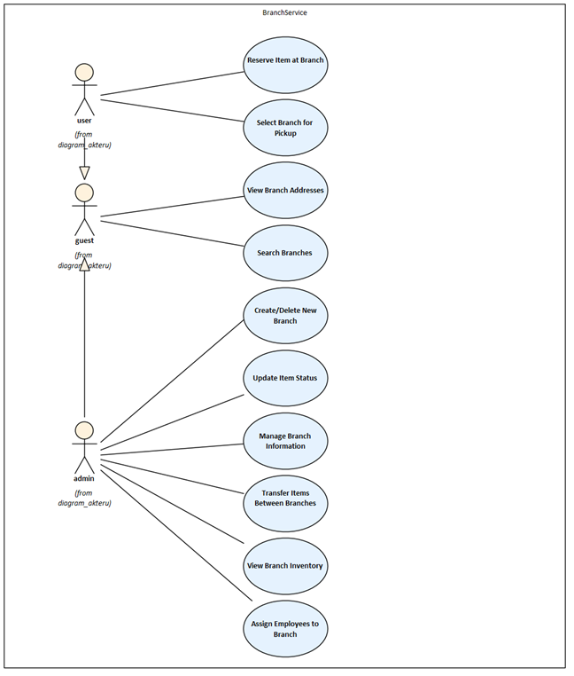
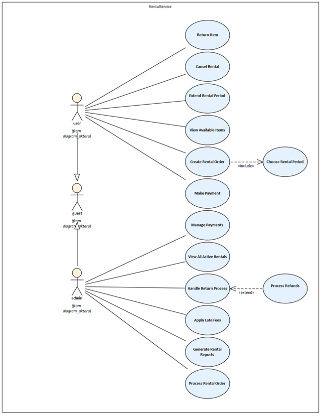
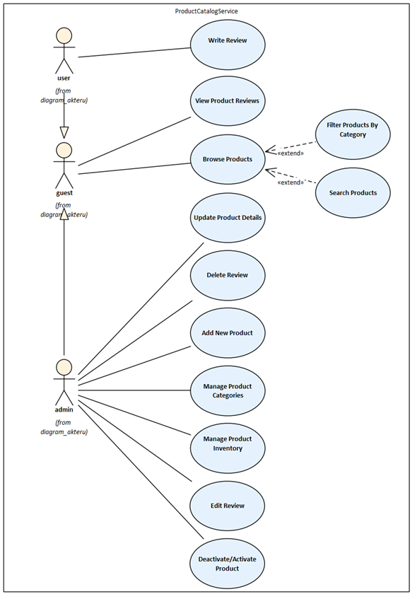
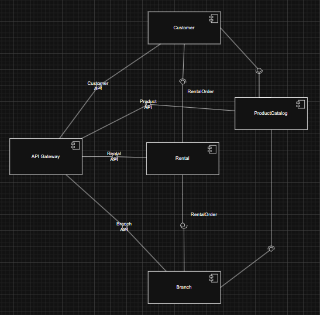
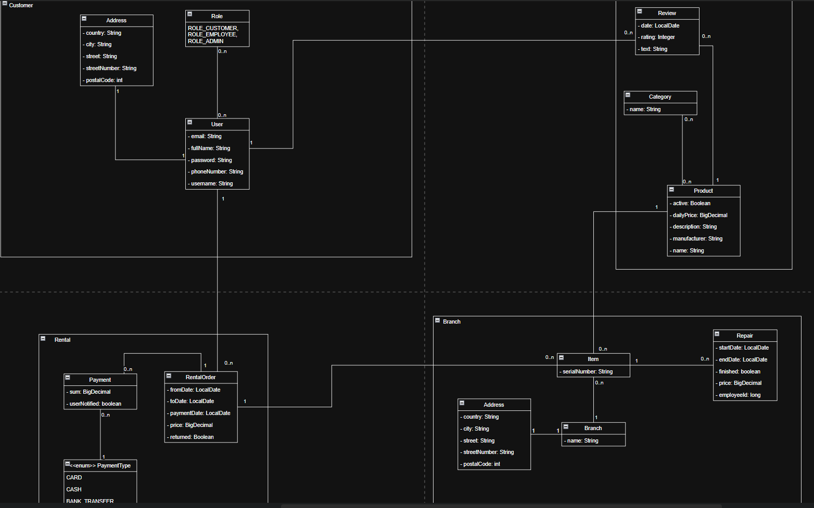
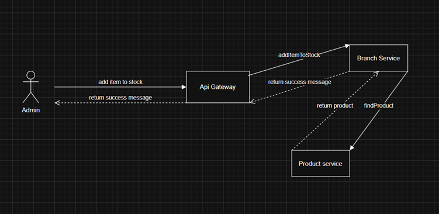

# Půjčovna zahradního vybavení
# Popis aplikace, motivace

Aplikace slouží jako digitální platforma pro půjčování zahradního vybavení. Umožňuje zákazníkům jednoduše najít, rezervovat potřebné vybavení, zatímco provozovateli poskytuje přehled a kontrolu nad celým procesem – od správy nabídky až po sledování financí.

Motivací na vývoj je nezávislé škálování jednotlivých komponent systému a jejich samostatné nasazení, protože jejich vytíženost se hodně liší.

V projektu jsem si chtěl vyzkoušet docker, docker compose, kafku, elastic, caching a podobné věci.

# Spuštění
Je použit docker a docker compose, je doporučené použít docker desktop.

Both:
```bash
docker-compose up --build
```

# Defaultní účty
### Admin
username: admin

password: admin
### Employee
username: employee

password: employee

Stará se o to commandline runner DatabaseInitializer v user microservice.
Pro testování doporučujeme použít admin účet, protože je třeba pro velké množství funkcioanlity ohledně produktů, popřípadě skladů.

# API dokumentace
Swagger jednotlivých service je dostupný na:
http://localhost:8081/swagger-ui/index.html
http://localhost:8082/swagger-ui/index.html
http://localhost:8084/swagger-ui/index.html

# Funkční požadavky

1. Zboží je děleno do kategorií (tvořené libovolně provozovatelem).
2. Uživatel prohlíží nabízené vybavení a vidí počet dostupných kusů.
3. Uživatel si půjčuje zahradní vybavení od provozovatele na daný čas.
4. Uživatel zobrazuje svoje výpůjčky.
5. Uživatel píše a čte recenze.
6. Provozovatel vytváří a odebírá nové zboží k výpůjčce.
7. Provozovatel zobrazuje souhrnná data o financích.
8. Provozovatel mění cenu, za kterou se zboží pronajímá.
9. Provozovatel potvrzuje navrácení půjčeného zboží.

# Nefunkční požadavky

1. Systém by mělo jít rychle nasadit na předchozí verzi v případě, že nová verze nefunguje.
2. Jednotlivé služby by měly být containerizované, aby šli nasadit v libovolném prostředí.
3. Služby by měli být klientem přístupné přes REST API.
4. Služby by měly být samostatně škálovatelné bez nutnosti škálování celého systému


# Seznam uživatelů


Guest je nepřihlášený uživatel, který si může jen prohlížet produkty. User je přihlášený uživatel, který si je může i půjčovat a kupovat. Admin je provozovatel a může je i naskladňovat.

# Případy užití
## CustomerService


## BranchService


## RentalService


## ProductCatalogService



# UML diagramy - class diagram, sequence diagram, component diagram - s popisem

Customer service komunikuje s product a rental, rental s customer a branch, product s customer a branch, branch s product a rental. API gateway komunikuje se vším, aby mohla na jedném místě nabízet služby ze všech microservis.
## Component diagram


## Class diagram


## Sequence diagram


