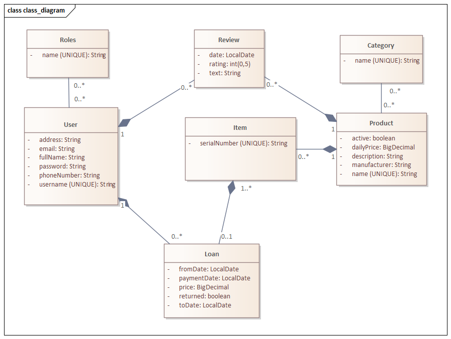
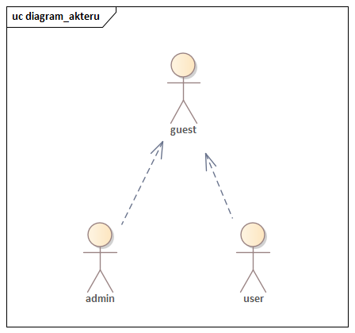
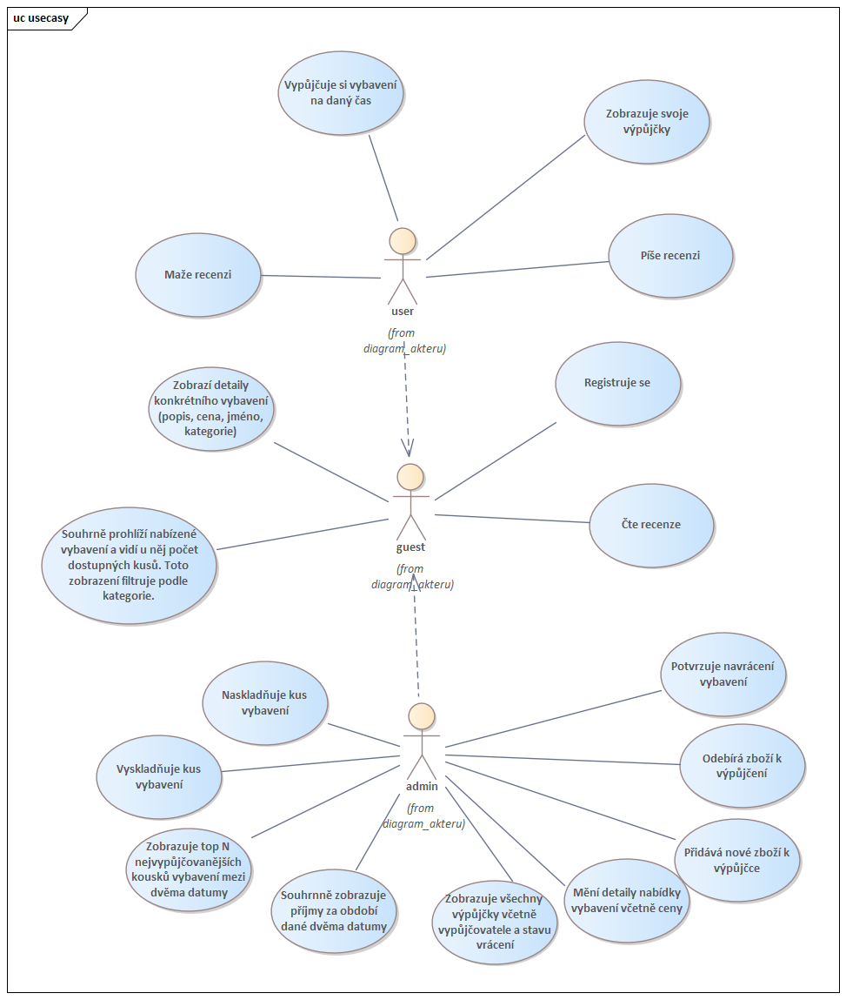

# Informační systém půjčovny na zahradní vybavení
Systém slouží pro správu půjčování zahradního vybavení.

Technický popis, návod na spuštění a závěr je dostupný na [docs/technical.md](docs/technical.md)

Testcasy k REST api jsou dostupné na [docs/testcases.md](docs/testcases.md)

Git pravidla pro vývoj projektu jsou dostupné na [docs/gitrules.md](docs.gitrules.md)

Po spuštění je možné nahlédnout na swagger REST API dokumentaci na http://localhost:8080/swagger-ui.html

Uživatelský/Businessový popis je v tomto souboru.

## Funkčné požadavky 

1. **Kategorizace vybavení**  
   - Zboží je rozděleno do kategorií, které si definuje provozovatel.

2. **Rezervace / výpůjčka**  
   - Uživatel si může vypůjčit vybavení na konkrétní časové období.

3. **Přehled výpůjček**  
   - Uživatel má možnost zobrazit své aktivní i minulé výpůjčky.

4. **Recenze**  
   - Uživatel může psát a číst recenze k vybavení.

5. **Správa nabídky ze strany provozovatele**  
   - Provozovatel může přidávat a odebírat položky z nabídky.

6. **Skladové operace**  
   - Provozovatel může naskladnit a vyskladnit vybavení.

## Nefunkční požadavky 

# Výkon
- Každá mikroservisa musí zvládnout alespoň X požadavků za sekundu.
- Odezva API by neměla přesáhnout X ms při běžném provozu.

# Dostupnost a odolnost
- Klíčové části systému (např. přihlášení, objednávky, rezervace) musí mít vysokou dostupnost (min. 99,9 % měsíčně).

# Logování a monitorování
- Všechny služby musí mít centrální logování (např. ELK stack nebo Grafana Loki).
- Pro každou mikroservisu jsou sbírány metriky (odpovědi, chyby, zatížení) pomocí Grafany.

# Dostupnost dat a konzistence
- Mikroservisy využívají vlastní databáze (pattern: Database per Service).
- Komunikace mezi službami je event-driven (pomocí Kafka).

## Hlavní funkce
- Zboží je děleno do kategorií (tvořené libovolně provozovatelem)
- Uživatel prohlíží nabízené vybavení a vidí počet dostupných kusů
- Uživatel si půjčuje zahradní vybavení od provozovatele na daný čas.
- Uživatel zobrazuje svoje výpůjčky
- Uživatel píše a čte recenze

- Provozovatel vytváří a odebírá nové zboží k výpůjčce.
- Provozovatel naskladňuje a vyskladňuje vybavení.
- Provozovatel zobrazuje souhrnná data o financích.
- Provozovatel mění cenu, za kterou se zboží pronajímá.
- Provozovatel potvrzuje navrácení půjčeného zboží.

## Typy uživatelů
Systém bude určen lidem, kteří si chtějí půjčit zahradní vybavení (zákazníci) a provozovateli a jeho zaměstnancům.
Nepřihlášený uživatel si může zobrazit nabízené zboží a jeho recenze, a registrovat se.
Uživatel (USER) může vidět jen údaje týkající se jeho, jeho výpůjček, půjčovat si a dívat se na nabídky vybavení.
Provozvatel (ADMIN) vidí data od všech a může i např. mazat nabídky vybavení nebo vytvářet nové. Také má přístup k souhrnným informacím,
jako inventář vybavení, právě vypůjčené vybavení, tržby za daný úsek atd. Také má práva na přidání a odebírání položek na skladě.

## Diagram tříd

## Uživatelské role

## Funkce (případy užití)

## Omezení

Systém nebude realizovat platby přes platební bránu
Nebudeme umožňovat uživateli měnit telefonní číslo nebo email nebo uživatelské jméno.
Nebudeme uvažovat, že půjčovna má více skladů. 
Nebudeme uvažovat košík výpůjček.
Nebudeme implementovat emailové nebo telefonní notifikace pozdního vrácení.
Provozovatel nebude mít možnost mazat (cenzurovat) review.
Zákazník nemůže měnit napsanou recenzi.